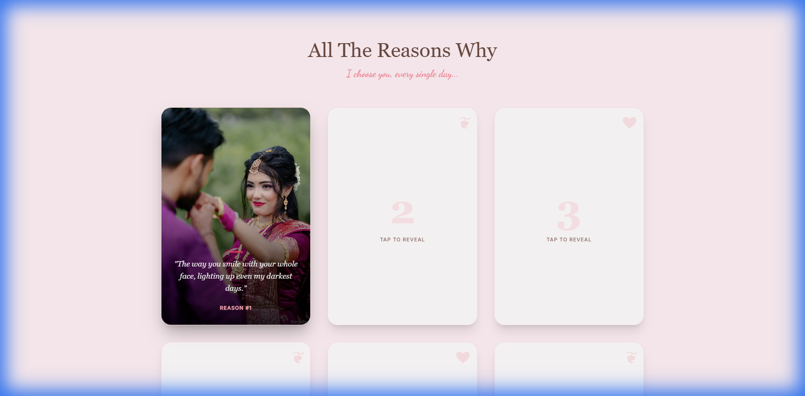

# 💝 Our Story — A Valentine's Tribute

A beautiful, interactive storytelling website built for Dristy, celebrating our journey from the first "Hello" to our "Forever".



## ✨ Features

- **📖 Interactive Timeline**: A scrollable journey through our key milestones (First Date, First Trip, The Proposal).
- **💌 Love Reasons Cards**: A 3D flip-card gallery sharing "All The Reasons Why" I choose you.
- **✨ Future Vision**: An interactive section visualizing our dreams together (Rainy days, Festivals, & more).
- **💍 The Proposal**: A special interactive question section ("Will you be my Valentine?").
- **🎨 Immersive Design**:
  - Floating hearts and falling petals animation.
  - Soft, romantic color palette (Rose & Cream).
  - Fully responsive mobile-first design.

## 🛠️ Tech Stack

- **Framework**: React 19 + Vite
- **Styling**: Tailwind CSS + Custom Animations
- **Language**: TypeScript
- **Icons**: Lucide React
- **Fonts**: Playfair Display (Serif), Dancing Script (Handwritten), Inter (Sans)

## 🚀 Getting Started

1.  **Clone the repository**:
    ```bash
    git clone https://github.com/yourusername/our-story.git
    ```
2.  **Install dependencies**:
    ```bash
    npm install
    ```
3.  **Run locally**:
    ```bash
    npm run dev
    ```

## 🖼️ Personalization

Update `constants.tsx` to customize:

- **TIMELINE_DATA**: Add your own dates and memories.
- **LOVE_REASONS**: Change the text on the cards.
- **IMAGES**: Swap the URLs for your own photos.

---

_Made with ❤️ for Valentine's Day 2026_
